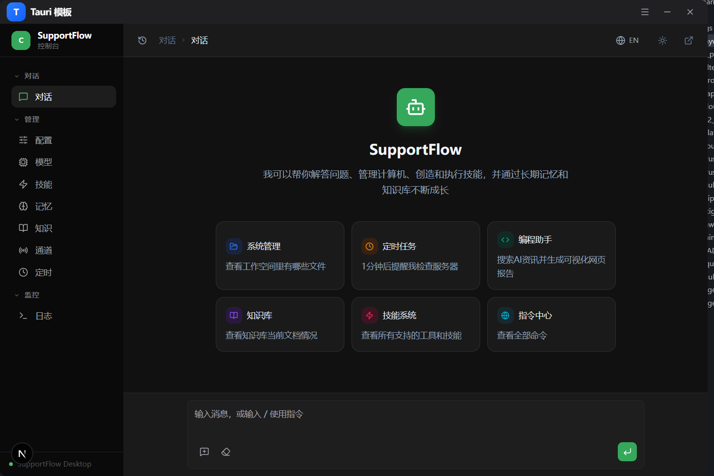

# SupportFlow · 智能客服

**SupportFlow** 是一款面向桌面端的 **AI 智能客服** 应用：在本地窗口中接待用户咨询、调用工具完成任务、结合记忆与知识库给出有据回答，并支持多模型、多通道扩展。数据与 API Key 保存在本机，适合团队内网部署或个人私有化使用。

**仓库**：[github.com/kingning2/SupportFlow](https://github.com/kingning2/SupportFlow)



---

## 产品能帮你做什么

| 场景           | 说明                                                            |
| -------------- | --------------------------------------------------------------- |
| **在线答疑**   | 多轮对话、流式回复，适合产品说明、售后 FAQ、操作指引            |
| **工单辅助**   | 读取/整理工作区文件，执行脚本，生成回复草稿                     |
| **知识库问答** | 检索记忆与知识文档（需在配置中开启 `knowledge`）                |
| **定时与提醒** | 通过对话创建定时任务，在「定时」页查看下次执行时间              |
| **多渠道扩展** | 规划接入微信、企业微信、飞书等，统一由 Agent 接待（通道管理页） |

---

## 功能一览

### 智能对话（客服主界面）

- **流式多轮对话**：实时输出回复，支持中止生成
- **思考过程展示**：展示模型推理过程（Reasoning 区块）
- **工具调用可视化**：展示 Agent 调用的工具名称、参数与执行结果
- **欢迎场景卡片**：一键发起常见任务
  - 系统管理（查看工作区文件）
  - 定时任务（如「1 分钟后提醒检查服务器」）
  - 编程助手（搜索资讯、生成报告等）
  - 知识库（查看文档情况）
  - 技能系统（查看已注册工具与技能）
  - 指令中心（查看全部 `/` 命令）
- **输入增强**：支持 `/` 斜杠指令；新建对话、清除上下文
- **未配置提示**：当前对话模型未配置 API Key 时，顶部横幅提醒
- **中英文界面**：控制台与系统标题栏可切换中文 / English
- **深色 / 浅色主题**：一键切换外观

### 控制台 · 对话

| 能力     | 说明                       |
| -------- | -------------------------- |
| 会话侧栏 | 查看会话入口、新建对话     |
| 历史会话 | 多会话持久化能力持续完善中 |

### 控制台 · 管理

| 模块     | 功能                                                                                                   |
| -------- | ------------------------------------------------------------------------------------------------------ |
| **配置** | 查看工作区路径、打包配置路径；`temperature` / `top_p` / 请求超时；MCP 服务连接状态                     |
| **模型** | 管理各厂商 API Key 与 Base URL；查看当前对话模型；切换厂商与模型 ID；凭据写入 `config.json` 后即时生效 |
| **技能** | 列出进程内已注册的**技能**与**工具**；刷新加载；显示启用 / 禁用状态；支持在工作区 `skills/` 目录扩展   |
| **记忆** | 浏览 Agent 记忆文件列表；查看文件内容与「梦境日记」；对话中可通过 `memory_search` / `memory_get` 检索  |
| **知识** | 知识库文档列表；上传文档入口；文档 / 知识图谱视图（图谱与入库能力持续完善）                            |
| **通道** | 管理已接入的消息通道；接入新通道（面向微信、企业微信、Web、飞书等扩展）                                |
| **定时** | 查看定时任务列表、名称、是否启用、下次执行时间                                                         |
| **日志** | 查看运行日志（`run.log`）；实时日志流；复制选中 / 全部                                                 |

### Agent 能力（对话中自动调用）

客服在后台可调用的内置工具（Rust Agent Runtime）：

| 工具            | 用途                                    |
| --------------- | --------------------------------------- |
| `read`          | 读取工作区文件                          |
| `write`         | 写入文件                                |
| `edit`          | 编辑文件                                |
| `bash`          | 执行 Shell 命令（可配置超时与安全模式） |
| `ls`            | 列出目录                                |
| `send`          | 发送 / 上传文件（可对接云存储）         |
| `memory_search` | 检索长期记忆与知识片段                  |
| `memory_get`    | 读取指定记忆内容                        |

此外还支持：

- **用户技能（Skills）**：从工作区加载 SKILL 定义，注入系统提示
- **MCP 工具**：读取工作区 `mcp.json`，支持 stdio / SSE / HTTP 等方式接入外部 MCP 服务
- **流式工具循环**：多轮调用模型直至给出最终答复

在 `config.json` 中可通过 `agent`、`knowledge` 开关控制 Agent 与知识检索行为。

### 支持的模型厂商

可在「模型」页或 `config.json` 中配置（部分厂商为只读展示，以控制台为准）：

DeepSeek · OpenAI / ChatGPT · Azure OpenAI · Claude · Google Gemini · 智谱 GLM · Moonshot · 豆包 / 火山方舟 · 通义 DashScope · MiniMax · LinkAI · 自定义 OpenAI 兼容 · 百度 · 千帆 · 讯飞星火 · ModelScope

### 桌面客户端

- **Tauri 2** 本地安装包，无需浏览器常驻
- **无边框主窗** + 圆角裁切，适配深色客服控制台 UI
- **独立 Modal 子窗口**：可扩展设置、关于等面板
- **配置本地化**：`src-tauri/resources/config.json`（参考 `config-template.json`）
- **可选工作区**：环境变量 `SUPPORT_FLOW_WORKSPACE` 指定 skills / memory / mcp 等目录

### 系统菜单（标题栏）

- 切换语言
- 反馈、联系支持、在线帮助、检查更新、关于

---

## 快速开始

### 环境

- [Bun](https://bun.sh/)
- [Rust](https://www.rust-lang.org/tools/install)
- Windows 或 macOS

### 安装运行

```bash
git clone https://github.com/kingning2/SupportFlow.git
cd SupportFlow
bun install
bun run tauri dev
```

### 配置客服模型

1. 复制 `src-tauri/resources/config-template.json` → `config.json`（若尚未存在）。
2. 填写所用厂商的 API Key，设置 `bot_type` 与 `model`（例如 `deepseek` + `deepseek-chat`）。
3. 按需设置 `"agent": true`、`"knowledge": true`。
4. 启动应用；也可在控制台 **「模型」** 页保存凭据。

### 可选：自定义工作区

在项目根 `.env` 中设置（参见 `.env.example`）：

```env
SUPPORT_FLOW_WORKSPACE=D:/path/to/your-workspace
```

---

## 技术栈

| 部分   | 技术                                               |
| ------ | -------------------------------------------------- |
| 桌面   | Tauri 2                                            |
| 界面   | Next.js、React、TypeScript、shadcn/ui、AI Elements |
| Agent  | Rust（`src-tauri/crates/agent`）                   |
| 模型层 | Rust（`src-tauri/crates/models`）                  |

---

## 参与开发

架构约定与 IPC 说明见 [`AGENTS.md`](./AGENTS.md)、[`docs/agent-console.md`](./docs/agent-console.md)、[`docs/development-rules/README.md`](./docs/development-rules/README.md)。

```bash
bun run check
bun run check:rust
bun run tauri dev
```

## 相关链接

- [GitHub 仓库](https://github.com/kingning2/SupportFlow)
- [Tauri 2](https://v2.tauri.app/) · [Next.js](https://nextjs.org/docs)
