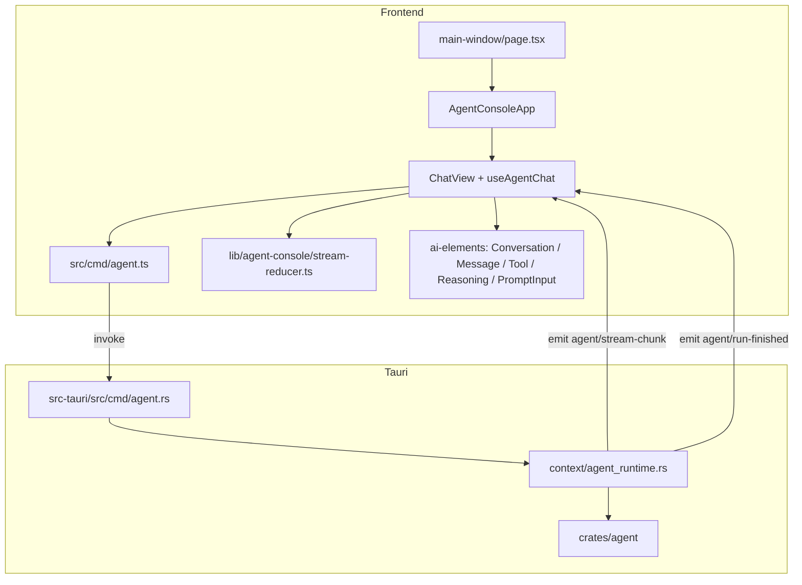

# Agent 控制台（SupportFlow Web → Tauri + AI Elements）

本文档记录主窗 **SupportFlow 控制台** 的前端架构、目录约定、IPC 契约与扩展方式。  
UI 基于 [Vercel AI Elements](https://elements.ai-sdk.dev)（shadcn/ui 注册表），布局视觉对齐 SupportFlow `channel/web/chat.html` 的深色侧栏。

---

## 概览

| 项        | 说明                                                              |
| --------- | ----------------------------------------------------------------- |
| 入口页面  | `src/app/main-window/page.tsx` → `AgentConsoleApp`                |
| UI 组件库 | AI Elements（`src/components/ai-elements/`）                      |
| 后端      | Rust `agent` crate + `src-tauri/src/context/agent_runtime.rs`     |
| 通信      | Tauri **Command**（请求/状态）+ **Event**（流式 chunk）           |
| 文案      | i18n 命名空间 `console`（`src-tauri/resources/languages/*.json`） |
| 固定标识  | `ConsoleView`、`AgentStreamChunkType`、`TauriCmd`、`TauriEvent`   |

---

## 架构



**流式对话时序：**

1. 用户发送 → `sendAgentMessage`（Command，立即返回 `requestId`）
2. Rust 在后台 `tokio::spawn` 执行 `run_agent_message`
3. 运行过程中 emit `TauriEvent.AgentStreamChunk`（reasoning / delta / tool_start / tool_end / cancelled / done）
4. 结束时 emit `TauriEvent.AgentRunFinished`（成功或 error）
5. 前端 `useAgentChat` 订阅 Event，`stream-reducer` 纯函数更新 `messages` 状态

---

## 目录结构

```
src/components/agent-console/
├── index.ts                         # 导出 AgentConsoleApp
├── constants/
│   ├── sidebar-nav.ts               # 侧栏分组、视图路由、占位视图集合
│   └── example-prompts.ts           # 欢迎页示例卡片
├── styles/console.css               # SupportFlow 侧栏 / 会话面板样式
├── layout/
│   ├── agent-console-app.tsx        # 根壳：视图切换、主题、加载/错误态
│   ├── console-sidebar.tsx          # 深色侧栏 #0A0A0A
│   ├── console-header.tsx           # 顶栏：面包屑、语言、主题、外链
│   └── session-panel.tsx            # 历史会话面板（当前仅展示当前 session）
├── chat/
│   ├── chat-view.tsx                # 对话视图入口
│   ├── chat-thread.tsx              # AI Elements Conversation 容器
│   ├── chat-composer.tsx            # AI Elements PromptInput 输入区
│   ├── message-blocks.tsx           # Message / Reasoning / Tool 渲染
│   └── welcome-screen.tsx           # 空态欢迎页 + 示例卡片
├── views/
│   ├── config-view.tsx              # 运行配置（已接 IPC）
│   ├── models-view.tsx              # 模型厂商（已接 IPC）
│   └── skills-view.tsx              # 技能与工具（已接 IPC）
└── shared/console-brand.tsx         # Logo、ViewShell、占位视图

src/components/ai-elements/          # shadcn CLI 安装的 AI Elements 源码（可改样式）
src/hooks/
├── use-agent-console-state.ts        # 加载 AgentConsoleState
└── use-agent-chat.ts                # 流式对话 + Event 订阅

src/lib/agent-console/
├── stream-reducer.ts                 # chunk → messages（纯函数，易单测）
├── map-tool-state.ts                 # ToolStep → AI Elements Tool state
├── theme-sync.ts                     # SupportFlow 主题 localStorage
└── provider-labels.ts                # bot_type → i18n key

src/types/agent-chat.ts              # 前端消息模型
src/enums/agent-stream-chunk-type.ts # 流 chunk type 枚举
src/cmd/agent.ts                     # IPC 封装（禁止组件内裸 invoke）
```

**职责边界（遵守 [frontend.md](./development-rules/frontend.md)）：**

- **components/**：展示与局部交互，不写 IPC 字符串
- **hooks/**：组合 cmd + Event + 状态
- **lib/agent-console/**：无 React 的纯逻辑
- **cmd/**：唯一 invoke 入口
- **generated/contracts.ts**：typeshare 生成，禁止手改

---

## AI Elements 组件映射

| SupportFlow 功能    | AI Elements                                                 | 封装位置             |
| ------------------- | ----------------------------------------------------------- | -------------------- |
| 消息列表 + 自动滚动 | `Conversation` / `ConversationContent`                      | `chat-thread.tsx`    |
| 用户 / 助手气泡     | `Message` / `MessageContent`                                | `message-blocks.tsx` |
| Markdown 流式渲染   | `MessageResponse`（Streamdown）                             | `message-blocks.tsx` |
| 推理过程            | `Reasoning` / `ReasoningTrigger` / `ReasoningContent`       | `message-blocks.tsx` |
| 工具调用            | `Tool` / `ToolHeader` / `ToolInput` / `ToolOutput`          | `message-blocks.tsx` |
| 输入框              | `PromptInput` / `PromptInputTextarea` / `PromptInputSubmit` | `chat-composer.tsx`  |
| 欢迎页快捷提示      | 自定义卡片（非 Suggestion 横条）                            | `welcome-screen.tsx` |

### 安装与更新

组件通过 shadcn CLI 从 AI Elements 注册表安装，源码落入 `src/components/ai-elements/`：

```bash
bunx shadcn@latest add \
  "https://elements.ai-sdk.dev/api/registry/conversation.json" \
  "https://elements.ai-sdk.dev/api/registry/message.json" \
  "https://elements.ai-sdk.dev/api/registry/prompt-input.json" \
  "https://elements.ai-sdk.dev/api/registry/tool.json" \
  "https://elements.ai-sdk.dev/api/registry/reasoning.json" \
  "https://elements.ai-sdk.dev/api/registry/code-block.json" \
  --yes --overwrite
```

- ESLint 对 `src/components/ai-elements/**` 已配置忽略（第三方生成风格代码）
- `button.tsx` 需包含 `icon-sm` size（AI Elements 依赖）

---

## IPC 契约

### Command（`src/cmd/agent.ts`）

| TauriCmd               | Rust                      | 说明                                   |
| ---------------------- | ------------------------- | -------------------------------------- |
| `AgentGetConsoleState` | `agent_get_console_state` | 工作区、模型、providers、tools、skills |
| `AgentSendMessage`     | `agent_send_message`      | 发送消息，返回 `requestId`（异步执行） |
| `AgentCancel`          | `agent_cancel`            | 取消指定 `requestId`                   |
| `AgentClearContext`    | `agent_clear_context`     | 清空 Agent 上下文                      |
| `AgentNewSession`      | `agent_new_session`       | 新建 session，返回新 `sessionId`       |
| `AgentRefreshSkills`   | `agent_refresh_skills`    | 刷新 skills 列表                       |

共享 DTO 见 `@/generated/contracts`：`AgentConsoleState`、`AgentSendMessageRequest`、`AgentStreamChunk`、`AgentRunFinished` 等。

### Event

| TauriEvent         | Rust 常量            | 载荷               |
| ------------------ | -------------------- | ------------------ |
| `AgentStreamChunk` | `agent/stream-chunk` | `AgentStreamChunk` |
| `AgentRunFinished` | `agent/run-finished` | `AgentRunFinished` |

### 流 chunk `type`（`AgentStreamChunkType`）

与 Rust `AgentRuntime::map_stream_event` 一致：

| type         | 含义                               |
| ------------ | ---------------------------------- |
| `reasoning`  | 推理文本增量                       |
| `delta`      | 回答文本增量                       |
| `tool_start` | 工具开始（含 `tool`、`arguments`） |
| `tool_end`   | 工具结束（含 `status`、`result`）  |
| `cancelled`  | 用户中止                           |
| `done`       | 流结束（含最终 `content`）         |

前端归并逻辑：`src/lib/agent-console/stream-reducer.ts`。

---

## 视图与接入状态

| ConsoleView | 侧栏 | 状态                            |
| ----------- | ---- | ------------------------------- |
| `chat`      | 对话 | ✅ 已接入（流式 + 工具 + 推理） |
| `config`    | 配置 | ✅ 已接入（只读展示）           |
| `models`    | 模型 | ✅ 已接入（只读展示）           |
| `skills`    | 技能 | ✅ 已接入（含刷新）             |
| `memory`    | 记忆 | ⏳ 占位（`PlaceholderView`）    |
| `knowledge` | 知识 | ⏳ 占位                         |
| `channels`  | 通道 | ⏳ 占位                         |
| `tasks`     | 定时 | ⏳ 占位                         |
| `logs`      | 日志 | ⏳ 占位                         |

占位视图集合：`PLACEHOLDER_CONSOLE_VIEWS`（`constants/sidebar-nav.ts`）。

---

## 主题与布局

- **SupportFlow 主题**：`LocalCacheKey.CowTheme`（`light` / `dark`，默认 `dark`），同步到 `<html class="dark">`
- **主色**：`#35A85B`（按钮、侧栏 active 图标 `#4ABE6E`）
- **侧栏**：固定 `#0A0A0A`，宽 `w-52`（`console-sidebar.tsx` + `styles/console.css`）
- **主窗布局**：页面使用 `-m-3` 抵消 `MainProvider` 内边距，全屏铺满控制台；内部链路透传 `min-h-0` + `overflow-hidden`

---

## i18n

- 命名空间：`console`
- 源文件：`src-tauri/resources/languages/cn.json`、`en.json`
- 页面用法：`useTranslation("console")`
- **不要**把展示文案写进 `src/enums/`；枚举只放 `ConsoleView`、`AgentStreamChunkType` 等标识符

---

## 与 SupportFlow HTML 版的区别

|         | SupportFlow `chat.html`            | Tauri 桌面版                                                          |
| ------- | ---------------------------------- | --------------------------------------------------------------------- |
| 后端    | Python `web_channel.py` HTTP + SSE | Rust `agent` + `models` crate，Tauri IPC + Event                      |
| 配置    | SupportFlow 目录下 `config.json`   | **同一份** `config.json`（工作区自动探测或 `SUPPORT_FLOW_WORKSPACE`） |
| AI 调用 | Python Bot → 厂商 API              | Rust Bot → 厂商 API（真实 HTTP，非 mock）                             |

**AI 已对接。** 若聊天返回 `401` 或 `null (Status: 401, …)`，表示请求已发出但 **API Key 无效或未配置**，不是 UI 未接 AI。

### 配置文件位置

**唯一配置源：** `src-tauri/resources/config.json`（开发）/ 安装包内 bundled resources（生产）。

| 文件                                       | 用途                                                                       |
| ------------------------------------------ | -------------------------------------------------------------------------- |
| `src-tauri/resources/config.json`          | 本地真实配置（**gitignore**，填 Key）                                      |
| `src-tauri/resources/config-template.json` | 仓库模板，随 Tauri 打包                                                    |
| `{workspace}/config.json`                  | 启动时从 resources **镜像**一份，供工具读取；**不要**在项目根目录放 config |

工作区（skills / memory / mcp）默认为 `{app_data}/SupportFlow`，可用 `SUPPORT_FLOW_WORKSPACE` 覆盖，**但不改变 config 来源**。

修改 `src-tauri/resources/config.json` 后 **重启** `bun run tauri dev`。

---

## 本地开发

```bash
# 桌面调试（需工作区 config.json 与 API Key）
bun run tauri dev

# 仅前端（无 Tauri 时 Agent IPC 不可用）
bun run dev

# 提交前
bun run check
bun run check:rust
```

Agent 初始化依赖工作目录下的 `config.json` 与对应厂商 API Key；加载失败时 `AgentConsoleApp` 展示 `load_failed` 错误态。

---

## 扩展指南

### 新增管理视图（例：记忆）

1. 若已有 `ConsoleView` 枚举成员，从 `PLACEHOLDER_CONSOLE_VIEWS` 移除
2. 在 `views/` 新建 `memory-view.tsx`
3. 在 `agent-console-app.tsx` 的 `viewContent` 分支挂载
4. 若需新 IPC：按 [fullstack-ipc.md](./development-rules/fullstack-ipc.md) 清单走完 Command/Event + typeshare

### 新增流事件类型

1. Rust `map_stream_event` 增加映射
2. `src/enums/agent-stream-chunk-type.ts` 增加枚举值
3. `stream-reducer.ts` 的 `applyStreamChunk` 增加分支
4. 必要时更新 `message-blocks.tsx` 展示

### 修改 AI Elements 样式

直接编辑 `src/components/ai-elements/` 下对应组件，或通过 `components.json` 重新 `shadcn add --overwrite` 覆盖（注意合并本地改动）。

---

## 相关文件（Rust）

| 路径                                     | 职责                     |
| ---------------------------------------- | ------------------------ |
| `src-tauri/src/cmd/agent.rs`             | Agent Command 薄入口     |
| `src-tauri/src/context/agent_runtime.rs` | Agent 运行时、流式 emit  |
| `src-tauri/crates/agent/`                | Agent 协议、工具、skills |
| `src-tauri/crates/models/`               | 多厂商 Bot               |
| `src-tauri/src/events/payloads.rs`       | Event 载荷 + typeshare   |

---

## 变更记录

| 日期    | 说明                                                                                           |
| ------- | ---------------------------------------------------------------------------------------------- |
| 2026-05 | 自 SupportFlow `chat.html` 迁移；采用 AI Elements；删除旧手写 markdown-it 控制台，重建分层目录 |
