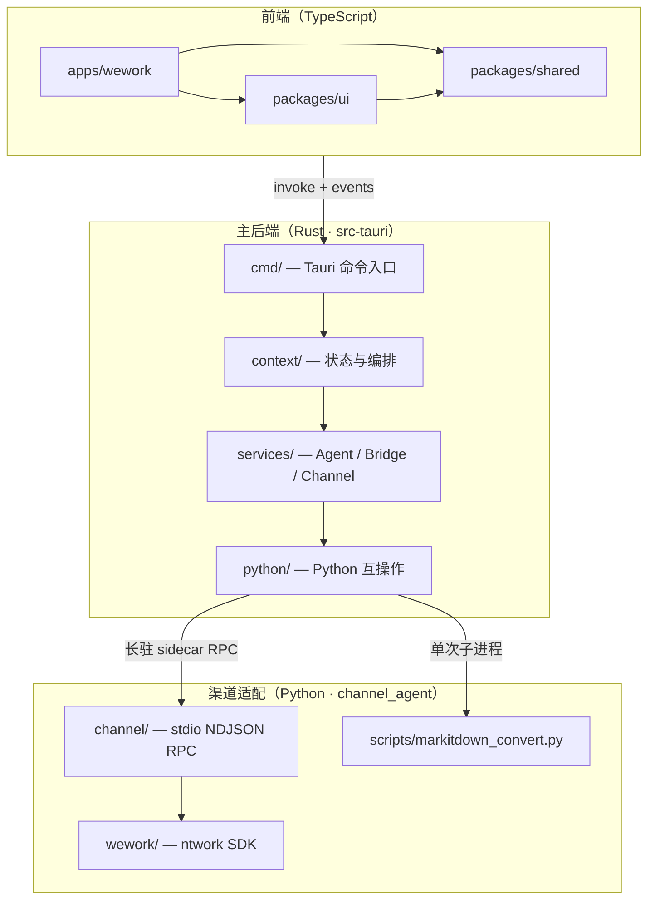

# 项目架构总览

SupportFlow 是一款 **Tauri 2 桌面 AI 智能客服** 应用。本仓库为 **pnpm monorepo**，由三层运行时协作：

| 层级         | 技术                               | 定位                                  |
| ------------ | ---------------------------------- | ------------------------------------- |
| **前端**     | TypeScript / React / Vite          | 界面、状态消费、Rust IPC 薄桥接       |
| **主后端**   | Rust（`src-tauri`）                | 编排、配置、Agent、渠道状态、IPC 契约 |
| **渠道适配** | Python sidecar（`channel_agent/`） | 企业微信 SDK 适配、最小 RPC           |

**核心原则：Python 更薄、Rust 更重、TS 更清晰。**

---

## 系统分层图



---

## 运行时边界

### 1. 前端 → Rust

- 前端通过 `packages/shared/src/tauri-bridge/` 调用 Tauri command、订阅事件。
- 共享类型由 `typeshare` 生成到 `packages/shared/src/contracts/`。
- 前端**不**承载后端策略（连接策略、Agent 编排、配置持久化等均在 Rust）。

### 2. Rust → Python

| 场景            | 方式               | 说明                                                                                  |
| --------------- | ------------------ | ------------------------------------------------------------------------------------- |
| 企业微信渠道    | **Tauri sidecar**  | PyInstaller `channel-sidecar` 或开发态 `python -m channel`；双向 **stdio NDJSON RPC** |
| 文档转 Markdown | **单次脚本子进程** | `markitdown_convert.py`，用完即退                                                     |
| 嵌入解释器      | **不使用 PyO3**    | 进程隔离：SDK 崩溃不拖垮桌面应用                                                      |

长驻 sidecar 与 markitdown 是**两套进程模型**，不得合并。

Rust 与 Python 的**唯一**对接层为 `src-tauri/src/python/`；`services/`、`context/` 只调用 `crate::python::*`，不自行 `Command::new("python")`。

### 3. Agent 运行时

- **LLM 编排**：`services/agent/rig/`（`rig-core`）
- **工具链**：`services/agent/tools/`（read、write、bash、MCP、memory、web_search 等）
- **知识库 / 记忆 / 技能**：`services/agent/knowledge`、`memory`、`skills`
- **桌面编排**：`context/agent_runtime` + `services/bridge`（`AgentBridge`、Bot 路由、配置同步）
- **工作区**：skills、memory、mcp 等目录，可通过 `SUPPORT_FLOW_WORKSPACE` 指定

### 5. 工作区数据层（SQLite）

| 路径                                    | 用途                                        |
| --------------------------------------- | ------------------------------------------- |
| `{workspace}/memory/long-term/index.db` | 长期记忆向量索引（`chunks`、`files`、FTS5） |
| `{workspace}/conversations/index.db`    | 会话持久化（`sessions`、`messages`）        |
| `{workspace}/workflows/index.db`        | 工作流状态（独立库，见 T002）               |

新安装默认会话库与记忆库分离。旧安装若会话表仍在记忆库中，可运行 `sf migrate-conversations` 幂等迁移。

### 4. 渠道运行时

- **编排与状态**：`context/channel/`（sidecar 协调、收件箱、账号、控制台 API）
- **领域服务**：`services/channel/`
- **消息纯算法**：`channel_runtime/`（前缀、关键词、回复装饰）
- **SDK 执行**：Python `channel_agent/channel/wework/`

---

## 单 crate 结构（Rust）

`src-tauri` 为**单一 workspace 成员**（`Cargo.toml` 中 `members = ["."]`），**不再维护** `src-tauri/crates/*` 子 crate。

| 模块                 | 职责                                                               |
| -------------------- | ------------------------------------------------------------------ |
| `cmd/`               | Tauri command 薄入口（`#[cfg(feature = "desktop")]`）              |
| `context/`           | 跨 Webview 共享状态、sidecar 运行态、业务编排                      |
| `services/agent/`    | Agent 工具链、rig LLM、知识库、记忆、技能                          |
| `services/bridge/`   | Bot 路由、`AgentBridge`、配置同步                                  |
| `services/channel/`  | 渠道配置等领域服务                                                 |
| `config/`            | `config.json` 模型、Provider 目录、Context/Reply 契约              |
| `io/`                | 带审计日志的文件 IO（`pub use io as fs_io`）                       |
| `channel_runtime/`   | 渠道消息纯算法                                                     |
| `process_runtime/`   | 子进程 spec、stdio NDJSON RPC 基础设施                             |
| `python/`            | sidecar 与 markitdown 调用                                         |
| `cli/` + `bin/sf.rs` | 无头 `sf` 命令（`default-features = false`，不链接 Tauri desktop） |
| `events/`            | 事件名、发射、载荷                                                 |
| `utils/`             | 无全局 Store 的通用工具                                            |

---

## 前端 monorepo 结构

```
packages/shared  →  IPC 桥接、contracts、Redux、渠道表单逻辑
packages/ui      → 设计系统、标题栏、Modal、Agent 控制台壳、通用组件
apps/wework      → 企业微信桌面前端（渠道私有页面与特性）
```

**依赖方向**：`shared` → `ui` → `apps/*`

- `packages/ui/agent-console/`：通用 Agent 控制台（对话、模型、技能、知识、通道等视图）
- `apps/wework/src/features/wework/`：企业微信专属（收件箱、账号、渠道导航、工作区布局）

---

## 构建与风味（Flavor）

| 命令                             | 说明                                         |
| -------------------------------- | -------------------------------------------- |
| `pnpm run tauri dev`             | 开发桌面应用                                 |
| `pnpm run tauri:dev:wework`      | 企业微信风味开发                             |
| `pnpm run build:channel-sidecar` | PyInstaller → `src-tauri/binaries/`          |
| `pnpm run generate:contracts`    | typeshare → `packages/shared/src/contracts/` |
| `pnpm run check` / `check:rust`  | 前端类型检查 / Rust 检查                     |

Tauri 配置：`tauri.conf.json`（默认）、`tauri.wework.conf.json`（企业微信风味）。

---

## 配置与资源

| 路径                              | 用途                                      |
| --------------------------------- | ----------------------------------------- |
| `src-tauri/resources/config.json` | 运行时配置（参考 `config-template.json`） |
| `src-tauri/resources/skills/`     | 内置技能定义                              |
| `src-tauri/binaries/`             | PyInstaller sidecar 产物                  |
| `.env`                            | 工作区路径等（见 `.env.example`）         |

---

## 各层详细文档

按语言拆分的规范与目录说明：

| 语言       | 架构                                               | 文件夹结构                                                   | 编码规范                                           |
| ---------- | -------------------------------------------------- | ------------------------------------------------------------ | -------------------------------------------------- |
| 全项目     | 本文档                                             | [project-folder-structure.md](./project-folder-structure.md) | —                                                  |
| Rust       | [rust-architecture.md](./rust-architecture.md)     | [rust-folder-structure.md](./rust-folder-structure.md)       | [rust-coding-rules.md](./rust-coding-rules.md)     |
| Python     | [python-architecture.md](./python-architecture.md) | [python-folder-structure.md](./python-folder-structure.md)   | [python-coding-rules.md](./python-coding-rules.md) |
| TypeScript | [ts-architecture.md](./ts-architecture.md)         | [ts-folder-structure.md](./ts-folder-structure.md)           | [ts-coding-rules.md](./ts-coding-rules.md)         |

协作入口：[AGENTS.md](../AGENTS.md)

---

## 运维与可观测性（MVP）

### Trace ID

一次 agent 回复的日志可通过 `trace_id` 串联：

| 来源       | `trace_id` 格式                               |
| ---------- | --------------------------------------------- |
| 工作流节点 | `wf-{workflow_run_id}`                        |
| 渠道会话   | `{session_id}` 或 `{session_id}:{request_id}` |

实现：`src-tauri/src/utils/trace.rs`；`AgentBridge::agent_reply` 在 `tracing` 日志中输出 `trace_id=…`。

前端 **Agent 控制台 → 日志** 在存在 `trace_id=` 字段时显示独立列（`packages/ui/.../logs.tsx`）。

### 本地指标

MVP 指标写入工作区 `{workspace}/.supportflow/metrics.json`（计数器 + 延迟累计）：

| 指标                     | 含义                         |
| ------------------------ | ---------------------------- |
| `agent_reply_total`      | agent 回复次数               |
| `agent_reply_errors`     | agent 回复失败次数           |
| `agent_reply_latency_ms` | 回复延迟（累计 ms / 样本数） |

实现：`src-tauri/src/context/metrics.rs`。

### 敏感信息

- 日志与工具输出中的 API Key、token 应在 agent system prompt 中要求脱敏
- 勿将 `.env`、`config.json` 密钥提交版本库

### 架构决策

- 多 sidecar 并发：见 [`sidecar-multislot-adr.md`](./sidecar-multislot-adr.md)（当前 **单活跃渠道**）
- 多 Agent 角色：见 [`multi-agent-role-model.md`](./multi-agent-role-model.md)
