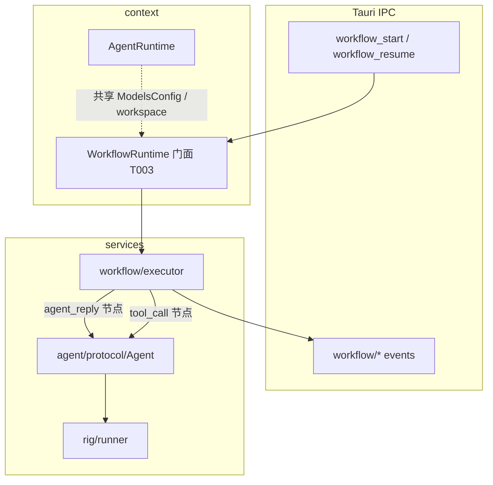
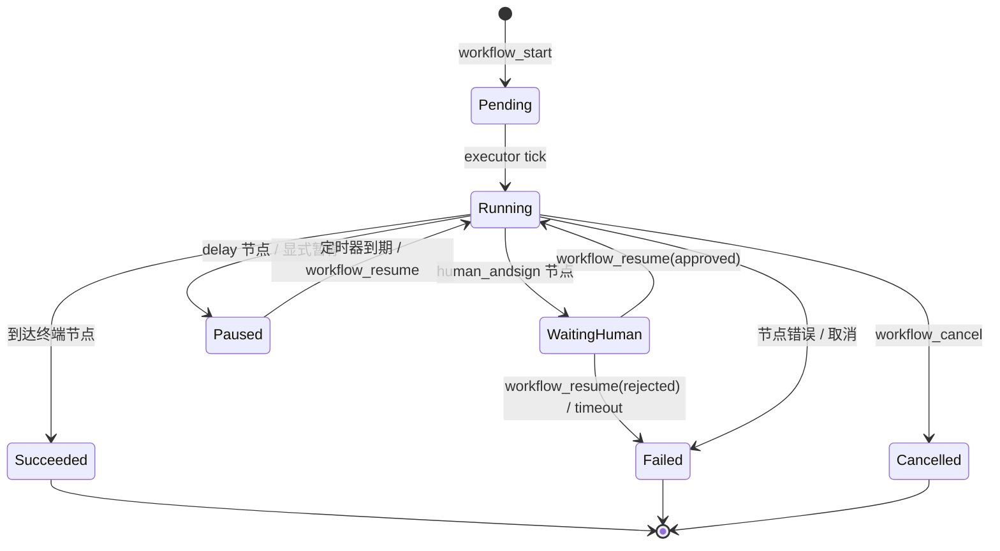
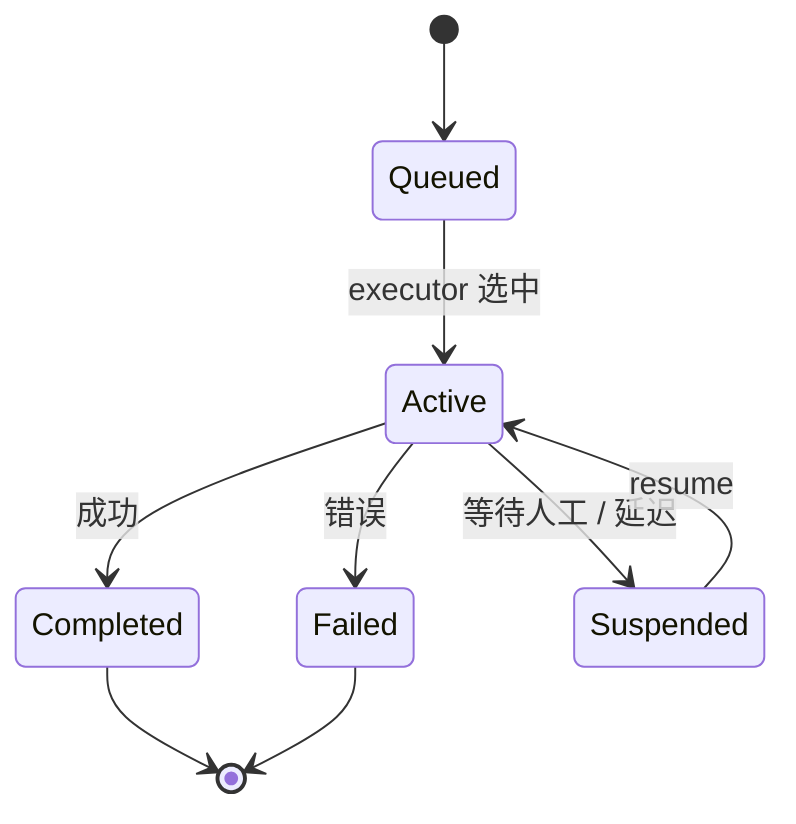
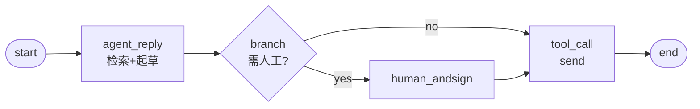

# Workflow Runtime MVP 设计

> 任务 T001 · 里程碑 M1  
> 状态：设计评审稿（实现见 T002–T003）

## 背景与目标

当前 `Agent::run_stream` + `rig` 提供**单会话多轮 tool loop**，适合自由对话，但缺少：

- 业务流程状态机（节点图、迁移条件）
- 跨轮次可恢复的执行上下文
- 人工审批 / 接管节点
- 条件分支与延迟调度

**Workflow Runtime** 在 Agent 之上增加编排层：**Workflow 编排 Agent，不替代 rig**。



## 领域模型

| 概念                   | 说明                                                      |
| ---------------------- | --------------------------------------------------------- |
| **WorkflowDefinition** | 静态图：节点列表 + 迁移边 + 入口节点 ID                   |
| **WorkflowRun**        | 一次执行实例：关联 definition、状态、当前节点、上下文变量 |
| **Step**               | Run 内单步记录：某节点的一次进入→退出（含输入/输出快照）  |
| **Node**               | 图顶点：类型 + 配置 + 出边                                |
| **Transition**         | 有向边：`from` → `to`，可选条件表达式                     |
| **WorkflowContext**    | Run 级 KV 变量（分支条件、节点输出、渠道元数据）          |

### 状态机（Run 级）



### 节点状态（Node 级，单次 Step 内）



## 首批节点类型（MVP）

| 类型            | 职责                                                | 与 Agent 关系             |
| --------------- | --------------------------------------------------- | ------------------------- |
| `agent_reply`   | 调用 `Agent::run_stream` 生成回复，结果写入 context | **直接调用**              |
| `tool_call`     | 执行单个内置/MCP 工具（不经 LLM 推理）              | 复用 `AgentTool::execute` |
| `human_andsign` | 暂停 Run，等待前端审批后继续                        | 无 Agent 调用             |
| `branch`        | 读取 context 表达式，选择出边                       | 纯逻辑                    |
| `delay`         | 暂停指定时长或直到 deadline                         | 纯调度                    |

MVP 范围：**线性链 + 单条件分支**；不支持并行 fork/join。

## 与现有 AgentRuntime 的关系

| 层级       | 模块                                    | 职责                                                     |
| ---------- | --------------------------------------- | -------------------------------------------------------- |
| IPC 薄入口 | `cmd/workflow_ipc.rs`（T003）           | `workflow_start` / `workflow_resume` / `workflow_cancel` |
| 编排门面   | `context/workflow_runtime.rs`（T003）   | 持有活跃 Run 表、桥接 `AgentRuntime`                     |
| 执行引擎   | `services/workflow/executor.rs`（T003） | 状态迁移、节点调度                                       |
| 领域类型   | `services/workflow/types.rs`            | Definition / Run / Node / Transition                     |
| 持久化     | `services/workflow/store.rs`（T002）    | SQLite / JSON 文件落盘                                   |
| LLM 对话   | `services/agent/protocol/agent.rs`      | **被** `agent_reply` 节点调用                            |
| 流式事件   | `context/agent_runtime/stream.rs`       | 现有 `agent/stream-chunk` 模式可复用                     |

**原则：**

1. `Agent::run_stream` 签名与 rig 管线**不变**；workflow 通过 `RunStreamOptions` 注入 `on_event` / `cancel`。
2. `AgentRuntime` 继续拥有 `ModelsConfig`、`workspace`、`McpToolLoader`；`WorkflowRuntime` 借用而非复制。
3. 渠道收件箱触发 workflow 属于 T006+；MVP 仅支持控制台 / IPC 显式启动。

## 持久化落点（T002 细化）

```
src-tauri/src/services/workflow/
  mod.rs
  types.rs       # 领域类型（本任务草稿）
  store.rs       # T002
  executor.rs    # T003
  mod.rs
```

建议存储路径：`{workspace}/.workflow/runs/{run_id}.json`（MVP），后续可迁 SQLite。

## IPC 与事件契约（草案）

### Commands（T003 实现）

| Command            | 请求                                                          | 响应               |
| ------------------ | ------------------------------------------------------------- | ------------------ |
| `workflow_start`   | `definition_id`, `input: Value`, `session_id?`                | `run_id`           |
| `workflow_resume`  | `run_id`, `action: approve \| reject \| continue`, `payload?` | `()`               |
| `workflow_cancel`  | `run_id`                                                      | `()`               |
| `workflow_get_run` | `run_id`                                                      | `WorkflowRun` 快照 |

### Events

| 事件名                   | 载荷要点                                          |
| ------------------------ | ------------------------------------------------- |
| `workflow/run-started`   | `run_id`, `definition_id`                         |
| `workflow/step-started`  | `run_id`, `step_id`, `node_id`, `node_type`       |
| `workflow/step-finished` | `run_id`, `step_id`, `status`, `output?`          |
| `workflow/waiting-human` | `run_id`, `node_id`, `prompt`, `context_snapshot` |
| `workflow/run-finished`  | `run_id`, `status`, `error?`                      |

现有 Agent 流式事件（`agent/stream-chunk`、`agent/run-finished`）在 `agent_reply` 节点内**照常发射**，并附带 `workflow_run_id` / `workflow_step_id` 扩展字段（T003）。

## 示例：客服自动回复流程



## 验收对照（T001）

- [x] 本文档含 Run / Node 状态机图
- [x] Rust 类型草稿见 `services/workflow/types.rs`
- [x] IPC / 事件集成点见上文「IPC 与事件契约」

## 参考

- `src-tauri/src/context/agent_runtime/stream.rs` — 现有流式 IPC 模式
- `src-tauri/src/cmd/agent_ipc.rs` — Command 命名与 typeshare 惯例
- `src-tauri/src/services/agent/protocol/agent.rs` — `Agent::run_stream`
